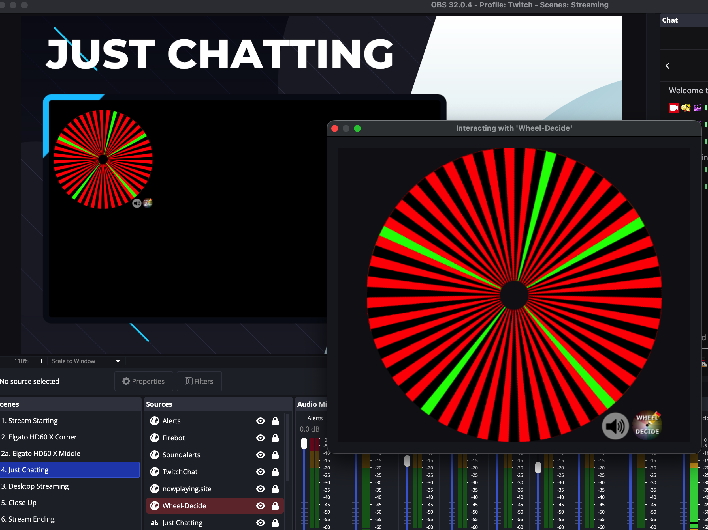

# obs-interact-click

Automates clicking inside an OBS browser source by opening the Interact window and sending a programmatic mouse click. Close the Interact window from an Elgato Stream Deck button using a companion bash script (mac specific). Main idea is to automate clicking on the spinwheel from a site like [wheeldecide.com](https://wheeldecide.com)

## Files

| File | Purpose |
|---|---|
| `obs-interact-click.lua` | OBS Lua script — opens Interact window and sends a click |
| `obs-interact-close.sh` | Bash script — closes the Interact window via AppleScript |



---

## Part 1 — OBS Lua Script (`obs-interact-click.lua`)

### What it does

1. Opens the OBS Interact window for a selected browser source
2. Waits 200 ms for the window to appear
3. Sends a left mouse click at the configured (X, Y) coordinates within the browser source

### Setup

**1. Load the script in OBS**

- Open OBS → **Tools > Scripts**
- Click **+** and select `obs-interact-click.lua`

**2. Configure the script**

In the Scripts panel:

- **Browser Source** — select the browser source you want to interact with from the dropdown
- **Click X / Click Y** — pixel coordinates within the browser source canvas (e.g. for a 1920×1080 source, values range from 0–1920 and 0–1080)

**3. Bind a hotkey**

- Open OBS → **Settings > Hotkeys**
- Search for **"Interact: Open Browser Source & Click"**
- Click the field next to it and press your desired key combination

**4. Trigger from Stream Deck**

- In the Stream Deck app, add a **Hotkey** action to a button
- Set it to the same key combination you bound in OBS Settings > Hotkeys

> **Tip:** Use the **"Interact & Click"** button in the Scripts panel to test the action before binding a hotkey.

---

## Part 2 — Close Script (`obs-interact-close.sh`)

### What it does

Finds the OBS Interact window (any window whose title starts with `"Interacting with "`) and clicks its close button using macOS Accessibility APIs via AppleScript.

> macOS only. Requires Accessibility permission for Terminal (or whichever app runs the script).

### Setup

**1. Make the script executable**

```bash
chmod +x /path/to/obs-interact-close.sh
```

**2. Rename to `.command` for Stream Deck**

```bash
cp obs-interact-close.sh obs-interact-close.command
chmod +x obs-interact-close.command
```

The `.command` extension causes macOS Terminal to execute the file directly when opened, which is what Stream Deck's Open action triggers.

**3. Grant Accessibility permission**

The first time the script runs, macOS will prompt to grant Accessibility access to Terminal (or Script Editor). Approve it under:

**System Settings > Privacy & Security > Accessibility**

**4. Add to Stream Deck**

- In the Stream Deck app, add an **Open** action to a button
- Set the file path to `obs-interact-close.command`

---

## Typical Workflow

| Step | Action | How |
|---|---|---|
| 1 | Trigger interact & click | Stream Deck button → OBS hotkey → `obs-interact-click.lua` |
| 2 | OBS opens Interact window | Automatic |
| 3 | Script clicks browser source | Automatic (200 ms after window opens) |
| 4 | Close Interact window | Stream Deck button → `obs-interact-close.command` |
