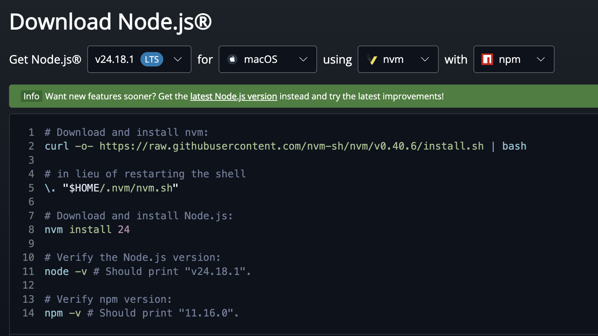
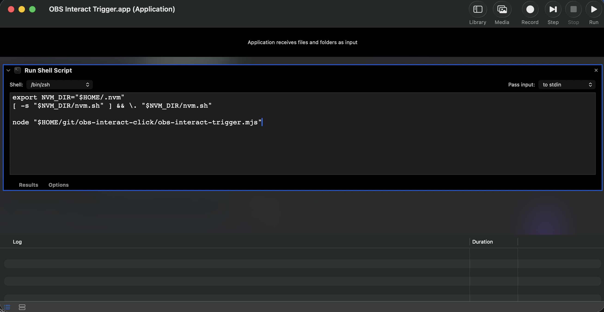
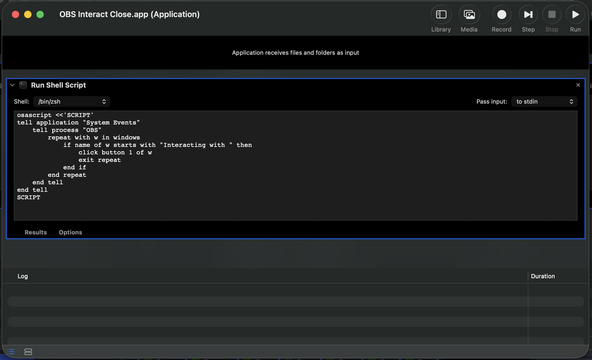

# obs-interact-click

Automates clicking inside an OBS browser source by opening the Interact window and sending a programmatic mouse click. Triggered from an Elgato Stream Deck via Automator (macOS). Main idea is to automate clicking a spinwheel on a site like [wheeldecide.com](https://wheeldecide.com).

## Files

| File | Purpose |
|---|---|
| `obs-interact-click.lua` | OBS Lua script — opens the Interact window and sends a click |
| `obs-interact-trigger.mjs` | Node script — triggers the click hotkey over obs-websocket |


---

## Part 1 — OBS Lua Script

1. Open OBS → **Tools > Scripts**, click **+**, and select `obs-interact-click.lua`
2. In the Scripts panel, configure:
   - **Browser Source** — select the browser source to interact with
   - **Click X / Click Y** — pixel coordinates within the browser source canvas (e.g. for a 1920×1080 source, values range from 0–1920 and 0–1080)

> **Tip:** Use the **"Interact & Click"** button in the Scripts panel to test without Stream Deck.

---

## Part 1b — Stream Deck Trigger (WebSocket)

Runs `obs-interact-trigger.mjs` via Node.js, which sends a `TriggerHotkeyByName` request over [obs-websocket](https://github.com/obsproject/obs-websocket) (built into OBS 28+). This bypasses OS-level keyboard focus — the click fires regardless of which app is active.

### Install Node.js

Install via [nvm](https://nodejs.org/en/download), so Automator keeps working across Node version upgrades instead of pointing at a hardcoded binary path:

```bash
curl -o- https://raw.githubusercontent.com/nvm-sh/nvm/v0.40.6/install.sh | bash
\. "$HOME/.nvm/nvm.sh"
nvm install 24
```



### Setup

**Enable the WebSocket server in OBS**

- OBS → **Tools > obs-websocket Settings**
- Check **Enable WebSocket server** (default port `4455`)
- The password is read automatically from `~/Library/Application Support/obs-studio/plugin_config/obs-websocket/config.json` — no manual configuration needed

**Create an Automator app**

1. Open **Automator** (`/Applications/Automator.app`)
2. **File > New** → choose **Application**
3. Search for `Run Shell Script` in the action library and drag it into the workflow
4. Set **Shell** to `/bin/zsh`, **Pass input** to `to stdin`
5. Replace the default script body with the following, substituting the actual path to this repo:
   ```sh
   export NVM_DIR="$HOME/.nvm"
   [ -s "$NVM_DIR/nvm.sh" ] && \. "$NVM_DIR/nvm.sh"

   node "$HOME/git/obs-interact-click/obs-interact-trigger.mjs"
   ```
6. **File > Save** — name it `OBS Interact Trigger` and save it anywhere convenient (e.g. `~/Applications/`)



**Add to Stream Deck**

- Add an **Open** action to a button
- Set the path to the `OBS Interact Trigger.app` you saved above

---

## Part 2 — Stream Deck Close Button

Finds the OBS Interact window (any window titled `"Interacting with …"`) and closes it using macOS Accessibility APIs via AppleScript.

### Setup

**Create an Automator app**

1. Open **Automator** (`/Applications/Automator.app`)
2. **File > New** → choose **Application**
3. Search for `Run Shell Script` in the action library and drag it into the workflow
4. Set **Shell** to `/bin/zsh`, **Pass input** to `to stdin`
5. Replace the default script body with:
   ```sh
   osascript <<'SCRIPT'
   tell application "System Events"
       tell process "OBS"
           repeat with w in windows
               if name of w starts with "Interacting with " then
                   click button 1 of w
                   exit repeat
               end if
           end repeat
       end tell
   end tell
   SCRIPT
   ```
6. **File > Save** — name it `OBS Interact Close` and save it anywhere convenient (e.g. `~/Applications/`)



**Grant Accessibility permission**

The AppleScript needs permission to control OBS window buttons.

- Open **System Settings > Privacy & Security > Accessibility**
- Click **+** and add the `OBS Interact Close.app` you saved above

> **Troubleshooting:** If you see `osascript is not allowed assistive access. (-25211)`, the app is not in the Accessibility list — add it as above. Re-saving the Automator app can revoke the grant; re-add it if the error reappears.

**Add to Stream Deck**

- Add an **Open** action to a button
- Set the path to the `OBS Interact Close.app` you saved above
